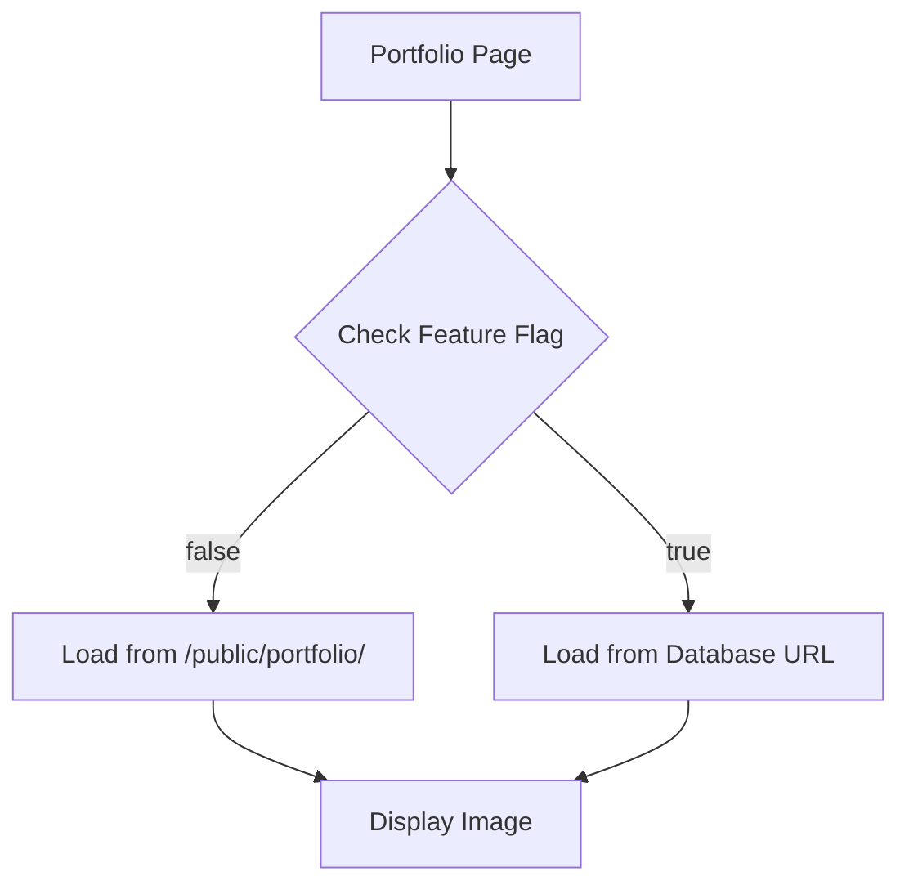

# Dual Image Source Strategy - Complete Guide

## Overview

This system allows you to switch between **two image sources** using a simple environment variable:

1. **Local Files** (`/public/portfolio/`) - Fast, free, version controlled
2. **Database URLs** (Supabase, Cloudinary, etc.) - Dynamic, admin panel manageable

---

## Quick Start

### Switch Image Source

**Edit `.env.local`:**

```bash
# Use local files (default)
NEXT_PUBLIC_USE_DB_IMAGES="false"

# Use database URLs (for admin panel)
NEXT_PUBLIC_USE_DB_IMAGES="true"
```

**Restart dev server:**

```bash
# Stop current server (Ctrl+C)
pnpm dev
```

That's it! No code changes needed.

---

## How It Works

### Architecture



### Feature Flag Configuration

**File:** [`src/config/portfolio.config.ts`](file:///home/av33/Documents/ceratlyin/src/config/portfolio.config.ts)

```typescript
export const PORTFOLIO_CONFIG = {
  // Read from environment variable
  useDbImages: process.env.NEXT_PUBLIC_USE_DB_IMAGES === "true",

  // Get correct URL based on flag
  getImageUrl: (dbUrl: string, localPath: string): string => {
    if (PORTFOLIO_CONFIG.useDbImages) {
      return dbUrl; // Use database URL
    }
    return localPath; // Use local path
  },
};
```

---

## Mode 1: Local Files (Default)

### When to Use

- ✅ Development
- ✅ You have all images ready
- ✅ Images don't change frequently
- ✅ Want fastest performance
- ✅ Want version control for images

### Configuration

**`.env.local`:**

```bash
NEXT_PUBLIC_USE_DB_IMAGES="false"
```

### Database Setup

Portfolio items in database should have **local paths**:

```sql
-- Example portfolio item
INSERT INTO portfolio_items (title, category, "imageUrl", ...)
VALUES (
  'Luxury Serum',
  'skincare',
  '/portfolio/skincare/luxury-serum.png',  -- Local path
  ...
);
```

### File Structure

```
/public/portfolio/
  /skincare/
    - luxury-serum.png
    - natural-beauty.png
  /food/
    - gourmet-dish.png
  /fashion/
    - modern-editorial.png
  /general/
    - tech-product.png
```

### Adding New Images

1. **Add file to `/public/portfolio/[category]/`**

   ```bash
   cp my-image.png public/portfolio/skincare/new-product.png
   ```

2. **Update database via Prisma Studio:**
   - Open: `pnpm prisma studio --schema=./src/Infrastructure/Database/prisma/schema.prisma`
   - Add new record:
     - title: "New Product"
     - category: "skincare"
     - imageUrl: `/portfolio/skincare/new-product.png`
     - order: 9
     - isActive: true

3. **Refresh portfolio page** - Done!

---

## Mode 2: Database URLs (Admin Panel Ready)

### When to Use

- ✅ Building admin panel
- ✅ Non-technical users will manage images
- ✅ Images change frequently
- ✅ Using CDN (Supabase Storage, Cloudinary)
- ✅ Want dynamic image management

### Configuration

**`.env.local`:**

```bash
NEXT_PUBLIC_USE_DB_IMAGES="true"
```

### Database Setup

Portfolio items should have **full URLs**:

```sql
-- Example with Supabase Storage
INSERT INTO portfolio_items (title, category, "imageUrl", ...)
VALUES (
  'Luxury Serum',
  'skincare',
  'https://dwzsvvixclxoysfhotuz.supabase.co/storage/v1/object/public/portfolio/skincare/luxury-serum.png',
  ...
);
```

### Supported URL Types

1. **Supabase Storage**

   ```
   https://[project-ref].supabase.co/storage/v1/object/public/[bucket]/[path]
   ```

2. **Cloudinary**

   ```
   https://res.cloudinary.com/[cloud-name]/image/upload/[path]
   ```

3. **Any CDN**
   ```
   https://cdn.example.com/images/portfolio/product.jpg
   ```

### Update next.config.js

Add the domain for external URLs:

```javascript
images: {
  domains: [
    "localhost",
    "dwzsvvixclxoysfhotuz.supabase.co", // Supabase
    "res.cloudinary.com", // Cloudinary
    // Add your CDN domain here
  ],
  formats: ["image/webp", "image/avif"],
},
```

---

## Database Schema

### Required Fields

```prisma
model PortfolioItem {
  id          String   @id @default(cuid())
  title       String   // REQUIRED: Display name
  category    String   // REQUIRED: 'skincare' | 'food' | 'fashion' | 'general'
  imageUrl    String   // REQUIRED: Local path OR full URL
  videoUrl    String?  // OPTIONAL: Video URL (future feature)
  description String?  // OPTIONAL: Item description
  order       Int      @default(0)  // REQUIRED: Display order (lower = first)
  isActive    Boolean  @default(true)  // REQUIRED: Show/hide item
  createdAt   DateTime @default(now())
}
```

### Field Descriptions

| Field         | Type     | Required | Description          | Example                                                        |
| ------------- | -------- | -------- | -------------------- | -------------------------------------------------------------- |
| `id`          | String   | Auto     | Unique identifier    | `clx123abc...`                                                 |
| `title`       | String   | ✅       | Display name         | `"Luxury Skincare Serum"`                                      |
| `category`    | String   | ✅       | Category slug        | `"skincare"`                                                   |
| `imageUrl`    | String   | ✅       | Image path/URL       | `/portfolio/skincare/serum.png` OR `https://cdn.com/serum.png` |
| `videoUrl`    | String   | ❌       | Video URL (optional) | `https://youtube.com/...`                                      |
| `description` | String   | ❌       | Item description     | `"Professional product photography"`                           |
| `order`       | Int      | ✅       | Display order        | `1` (shows first)                                              |
| `isActive`    | Boolean  | ✅       | Visibility           | `true` (visible)                                               |
| `createdAt`   | DateTime | Auto     | Creation timestamp   | `2026-02-03T12:00:00Z`                                         |

---

## Adding Images to Database

### Method 1: Prisma Studio (Visual Interface)

1. **Open Prisma Studio:**

   ```bash
   pnpm prisma studio --schema=./src/Infrastructure/Database/prisma/schema.prisma
   ```

2. **Navigate to PortfolioItem table**

3. **Click "Add record"**

4. **Fill in required fields:**
   - **title**: `"My Amazing Product"`
   - **category**: `"skincare"` (must be: skincare, food, fashion, or general)
   - **imageUrl**:
     - Local mode: `/portfolio/skincare/my-product.png`
     - DB mode: `https://your-cdn.com/my-product.png`
   - **description**: `"Beautiful product photography"` (optional)
   - **order**: `9` (higher number = shows later)
   - **isActive**: `true`

5. **Click "Save 1 change"**

6. **Refresh portfolio page** - Your item appears!

### Method 2: SQL Query

```sql
INSERT INTO portfolio_items (
  id,
  title,
  category,
  "imageUrl",
  description,
  "order",
  "isActive",
  "createdAt"
)
VALUES (
  gen_random_uuid(),
  'My Product Name',
  'skincare',
  '/portfolio/skincare/my-product.png',  -- Local path
  'Product description here',
  9,
  true,
  NOW()
);
```

### Method 3: Seed Script

Create a custom seed file:

```typescript
// src/Infrastructure/Database/prisma/seeds/my-portfolio.ts
import { PrismaClient } from "@prisma/client";

const prisma = new PrismaClient();

async function main() {
  await prisma.portfolioItem.create({
    data: {
      title: "My Product",
      category: "skincare",
      imageUrl: "/portfolio/skincare/my-product.png",
      description: "Amazing product",
      order: 9,
      isActive: true,
    },
  });
}

main();
```

Run it:

```bash
pnpm tsx src/Infrastructure/Database/prisma/seeds/my-portfolio.ts
```

---

## Uploading Images to Supabase Storage

### Step 1: Create Storage Bucket

1. Go to **Supabase Dashboard** → **Storage**
2. Click **"New bucket"**
3. Name: `portfolio-images`
4. Set to **Public** (so images are accessible)
5. Click **"Create bucket"**

### Step 2: Upload Images

1. Click on `portfolio-images` bucket
2. Create folders: `skincare`, `food`, `fashion`, `general`
3. Click **"Upload file"** in each folder
4. Select your images
5. Click **"Upload"**

### Step 3: Get Public URL

1. Click on uploaded image
2. Click **"Copy URL"**
3. URL format:
   ```
   https://dwzsvvixclxoysfhotuz.supabase.co/storage/v1/object/public/portfolio-images/skincare/product.png
   ```

### Step 4: Add to Database

Use Prisma Studio or SQL to add the Supabase URL to `imageUrl` field.

### Step 5: Enable DB Mode

```bash
# .env.local
NEXT_PUBLIC_USE_DB_IMAGES="true"
```

### Step 6: Update next.config.js

```javascript
images: {
  domains: [
    "localhost",
    "dwzsvvixclxoysfhotuz.supabase.co",  // Add this
  ],
}
```

---

## Migration Between Modes

### Local → Database URLs

1. **Upload images to CDN** (Supabase, Cloudinary, etc.)
2. **Update database:**
   ```sql
   UPDATE portfolio_items
   SET "imageUrl" = 'https://cdn.com/skincare/luxury-serum.png'
   WHERE "imageUrl" = '/portfolio/skincare/luxury-serum.png';
   ```
3. **Enable DB mode:**
   ```bash
   NEXT_PUBLIC_USE_DB_IMAGES="true"
   ```
4. **Update next.config.js** with CDN domain
5. **Restart server**

### Database URLs → Local

1. **Download images from CDN**
2. **Save to `/public/portfolio/[category]/`**
3. **Update database:**
   ```sql
   UPDATE portfolio_items
   SET "imageUrl" = '/portfolio/skincare/luxury-serum.png'
   WHERE "imageUrl" LIKE '%cdn.com%';
   ```
4. **Disable DB mode:**
   ```bash
   NEXT_PUBLIC_USE_DB_IMAGES="false"
   ```
5. **Restart server**

---

## Troubleshooting

### Images not loading?

**Check 1: Feature flag**

```bash
# In .env.local
echo $NEXT_PUBLIC_USE_DB_IMAGES
```

**Check 2: Image paths in database**

- Open Prisma Studio
- Check `imageUrl` field format
- Local mode: Should start with `/portfolio/`
- DB mode: Should be full URL

**Check 3: next.config.js domains**

- If using external URLs, domain must be in `images.domains`

**Check 4: File exists**

```bash
# For local mode
ls -la public/portfolio/skincare/
```

**Check 5: Restart server**

```bash
# Environment variables require restart
pnpm dev
```

### Admin panel coming soon?

When you build an admin panel, it will:

1. Upload images to Supabase Storage
2. Save URLs to database
3. Set `NEXT_PUBLIC_USE_DB_IMAGES="true"`
4. Users can manage images without code changes!

---

## Best Practices

✅ **DO:**

- Use local files for development
- Use database URLs for production with admin panel
- Keep image file sizes < 500KB (optimize with TinyPNG)
- Use descriptive filenames: `luxury-serum.png` not `img1.png`
- Set meaningful order numbers (1, 2, 3... or 10, 20, 30...)

❌ **DON'T:**

- Mix local paths and URLs in same mode
- Forget to update next.config.js when adding new domains
- Use very large images (> 2MB)
- Forget to restart server after changing .env.local

---

## Summary

| Aspect             | Local Files                    | Database URLs                        |
| ------------------ | ------------------------------ | ------------------------------------ |
| **Setup**          | Copy files to `/public/`       | Upload to CDN                        |
| **Database**       | Local paths (`/portfolio/...`) | Full URLs (`https://...`)            |
| **Feature Flag**   | `false`                        | `true`                               |
| **next.config.js** | No domains needed              | Add CDN domain                       |
| **Admin Panel**    | Not possible                   | ✅ Fully manageable                  |
| **Performance**    | Fastest                        | Fast (with CDN)                      |
| **Cost**           | FREE                           | FREE (Supabase/Cloudinary free tier) |
| **Migration**      | Easy                           | Easy                                 |

---

## Next Steps

1. **For now:** Keep `NEXT_PUBLIC_USE_DB_IMAGES="false"` (local files)
2. **When building admin panel:** Switch to `"true"` and use Supabase Storage
3. **Migration is easy:** Just update database URLs and flip the flag!

**No code changes needed - just configuration!** 🎉
